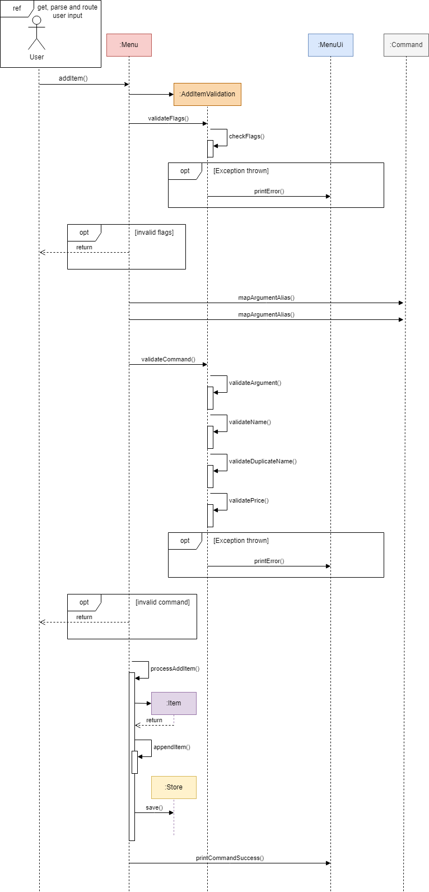
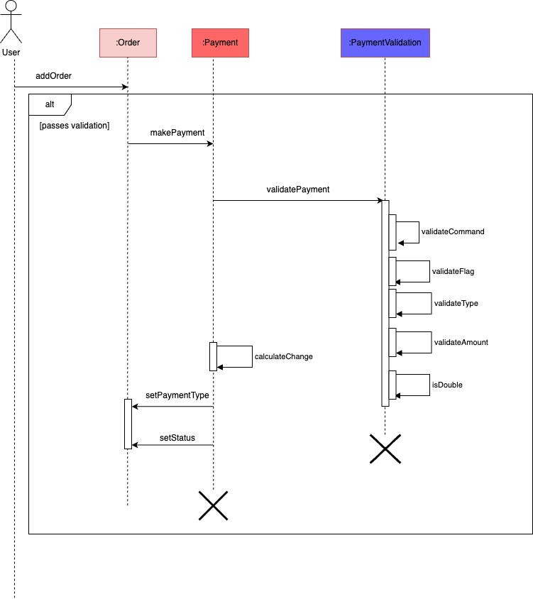

# Developer Guide

## Table of Contents

* [Acknowledgements](#acknowledgements)
* [Introduction](#introduction)
* [Design](#design)
* [Implementation](#implementation)
* [Requirements](#requirements)
    * [Project Scope](#project-scope)
    * [User Stories](#user-stories)
    * [Non-functional Requirements](#non-functional-requirements)
    * [Glossary](#glossary)

## Acknowledgements

## Introduction

The aim of this guide is to provide a comprehensive explanation of the internal mechanisms of MoneyGoWhere.
This will enable upcoming software engineers to acquire a detailed understanding of the application's implementation,
making it easier for them to work on the project.

For all sequence diagrams included in this guide, we will not include the interaction 
with the Parser and Router classes as it is implied that all inputs will first be parsed through them. 

## Design

## Implementation

### Item Commands

#### Overview

* [Add an Item](#add-an-item)
  * [Advanced Mode](#advanced-mode-add-an-item)
  * [Basic Mode](#basic-mode-add-an-item)
* [Delete an Item](#delete-an-item)
  * [Advanced Mode](#advanced-mode-delete-an-item)
  * [Basic Mode](#basic-mode-delete-an-item)
* [List all Items](#list-all-items)
* [Update an Item](#update-an-item)
    * [Advanced Mode](#advanced-mode-update-an-item)
    * [Basic Mode](#basic-mode-update-an-item)
* [Find an Item](#find-an-item)
  * [Advanced Mode](#advanced-mode-find-an-item)
  * [Basic Mode](#basic-mode-find-an-item)

#### Add an Item

##### Advanced Mode Add an Item
The expected inputs to add only one menu item into an order is as such:
* `/additem -n <item_name> -p <price>`

This sequence diagram models the interaction between various components in MoneyGoWhere when the user inputs the 
command `/additem`.

The general workflow of `/additem` is as follows:
1. User input is passed to `MoneyGoWhere`.
1. `MoneyGoWhere` then creates a new `Command` object using the user input, whose constructor invokes 
`Parser#formatArguments` method to extract the arguments for each flag into a `Map`.
1. `Router#handleRoute` is then invoked to process the command and calls `Router#proRoute` which invokes `Menu#addItem` 
method to run the `/additem` command.
1. Once the command runs, `Menu#addItem` invokes `AddItemValidation#validateFlags` to check if all the required flags 
have been given.
    * If there are missing flags, a message indicating that the usage is invalid will be printed using `Ui#println` and 
   control is given back to `MoneyGoWhere`.
1. `Menu#addItem` then invokes `AddItemValidation#validateCommand` which in turn, calls all the following validation 
method to check the arguments provided.
    * `AddItemValidation#validateArgument` checks if the user input `String` is empty
        * If the user input is empty, a message indicating that the input is empty is printed using `MenuUi#printError` 
      and control is given back to `MoneyGoWhere`.
    * `AddItemValidation#validateName` checks if the given name is empty or exceeds the limit of 25 characters
        * If the name violates these naming constraints, a message indicating that the name is too short or too long is 
      printed using `MenuUi#printError` and control is given back to `MoneyGoWhere`.
    * `AddItemValidation#validateDuplicateName` checks if the given name already exists in the `ArrayList<Item> items` 
   of `Menu`.
        * If the name already exists, a message indicating that the item name already exists is printed using 
      `MenuUi#printError` and control is given back to `MoneyGoWhere`.
    * `AddItemValidation#validatePrice` checks if the given price is empty, is not a number, is negative or has more 
   than 2 decimal points
        * If any of the above is true, a message indicating the constraint that it has violated is printed using 
      `MenuUi#printError` and control is given back to `MoneyGoWhere`.
1. `Menu#processAddItem` is then invoked and it creates a new`Item` object using the name and price given. It then 
calls `Menu#appendItem` on the new `Item` object to add it to `ArrayList<Item> items` in `Menu`. 
Then, `Menu#save` is invoked to save the changes to the local storage file.
1. `Router` object then calls `MenuUi#printCommandSuccess` to print a message indicating that the item has been 
successfully added to the menu.

##### Basic Mode Add an Item
The expected inputs to add only one menu item into an order is as such:
* `additem`
* `1`

This sequence diagram models the interaction between various components in MoneyGoWhere when the user inputs the 
command `additem` or `1`.

The general workflow of `additem` is as follows:
1. `MoneyGoWhere` then creates a new `Command` object using the user input, whose constructor invokes 
`Parser#formatArguments` method to extract the arguments for each flag into a `Map`.
1. `Router#handleRoute` is then invoked to process the command and calls `Router#assistRoute` which invokes 
`MenuAssistant#addItem` method to run the `additem` command.
1. Once the command runs, it can be aborted at any time when the user inputs `/cancel`.
1. `MenuAssistant#addItem` invokes `MenuAssistant#getName` to get the name of the item to be added.
1. `MenuAssistant#getName` gets the name from the user and invokes `AddItemValidation#validateName` to check if the 
given name is empty or exceeds the limit of 25 characters and `AddItemValidation#validateDuplicateName` to check if 
the given name already exists in the `ArrayList<Item> items` of `Menu`
    * If the name violates these naming constraints, a message indicating that the name is too short or too long is 
   printed using `MenuUi#printError` and re-prompts the user to enter a new name.
    * If the name already exists, a message indicating that the item name already exists is printed using 
   `MenuUi#printError` and re-prompts the user to enter a new name.
1. `MenuAssistant#addItem` then invokes `MenuAssistant#getPrice` to get the price of the item to be added.
1. `MenuAssistant#getPrice` gets the price from the user and invokes `AddItemValidation#validatePrice` to check if the 
given price is empty, is not a number, is negative or has more than 2 decimal points
    * If any of the above is true, a message indicating the constraint that it has violated is printed using 
   `MenuUi#printError` and re-prompts the user to enter a new price.
1. A new `Item` object is then created using the name and price given
1. `Menu#appendItem` is invoked on the new `Item` object to add it to `ArrayList<Item> items` in `Menu`.
1. The, `Menu#save` is invoked to save the changes to the local storage file.
1. `Router#assistRoute` then calls `MenuAssistant#printResult` to print a message indicating that if the item has been 
successfully added to the menu or if the user has cancelled the command accordingly.

#### Delete an Item

##### Advanced Mode Delete an Item
The expected inputs to add only one menu item into an order is as such:
* `/deleteitem -i <index>`

This sequence diagram models the interaction between various components in MoneyGoWhere when the user inputs the 
command `/deleteitem`.

The general workflow of `/deleteitem` is as follows:
1. User input is passed to `MoneyGoWhere`.
1. `MoneyGoWhere` then creates a new `Command` object using the user input, whose constructor invokes 
`Parser#formatArguments` method to extract the arguments for each flag into a `Map`.
1. `Router#handleRoute` is then invoked to process the command and calls `Router#proRoute` which invokes 
`Menu#deleteItem` method to run the `/deleteitem` command.
1. Once the command runs, `Menu#deleteItem` checks if the list of items is empty. If empty, a message indicating that 
there is nothing to be deleted using `MenuUi#printError` and control is given back to `MoneyGoWhere`.
1. `Menu#deleteItem` invokes `DeleteItemValidation#validateFlags` to check if all the required flags have been given.
    * If there are missing flags, a message indicating that the usage is invalid will be printed using 
   `MenuUi#printError` and control is given back to `MoneyGoWhere`.
1. `Menu#deleteItem` then invokes `DeleteItemValidation#validateCommand` which in turn, calls all of the following 
validation method to check the arguments provided.
    * `DeleteItemValidation#validateArgument` checks if the user input `String` is empty
        * If the user input is empty, a message indicating that the input is empty is printed using `MenuUi#printError` 
      and control is given back to `MoneyGoWhere`.
    * `DeleteItemValidation#validateIndex` checks if the given index is valid and exists
        * If the index is invalid, a message indicating the index does not exists is printed using `MenuUi#printError` 
      and control is given back to `MoneyGoWhere`.
1. `Menu#processDeleteItem` is then invoked, and it calls `Menu#removeItem` on the given index to delete it from the 
list of items. Then, `Menu#save` is invoked to save the changes to the local storage file.
1. `Router` object then calls `MenuUi#printCommandSuccess` to print a message indicating that the item has been 
successfully added to the menu.

##### Basic Mode [Delete an Item]()
The expected inputs to add only one menu item into an order is as such:
* `deleteitem`
* `2`

This sequence diagram models the interaction between various components in MoneyGoWhere when the user inputs the 
command `deleteitem` or `2`.

The general workflow of `deleteitem` is as follows:
1. `MoneyGoWhere` then creates a new `Command` object using the user input, whose constructor invokes 
`Parser#formatArguments` method to extract the arguments for each flag into a `Map`.
1. `Router#handleRoute` is then invoked to process the command and calls `Router#assistRoute` which invokes 
`MenuAssistant#deleteItem` method to run the `deleteitem` command.
1. Once the command runs, it can be aborted at any time when the user inputs `/cancel`.
1. `MenuAssistant#deleteItem` checks if the list of items is empty. If empty, a message indicating that there is 
nothing to be deleted using `MenuUi#printError` and control is given back to `MoneyGoWhere`.
1. `MenuAssistant#deleteItem` invokes `MenuAssistant#getIndex` to get the index of the item to be deleted.
1. `MenuAssistant#getIndex` gets the index from the user and invokes `DeleteItemValidation#validateIndex` if the given 
index is valid and exists.
    * If the index is invalid, a message indicating the index does not exist is printed using `MenuUi#printError` 
   and re-prompts the user to enter a new index.
1. A new `Item` object is then created using the name and price given
1. `Menu#removeItem` is then invoked on the given index to delete it from the list of items. Then, `Menu#save` is 
invoked to save the changes to the local storage file.
1. `Router#assistRoute` then calls `MenuAssistant#printResult` to print a message indicating that if the item has been 
successfully added to the menu or if the user has cancelled the command accordingly.

#### List all Items

#### Update an Item

##### Advanced Mode Update an Item
The expected inputs to add only one menu item into an order is as such:
* `/updateitem -i <index> -n <name> -p <price>`, where `-n <name>` and `-p <price>` are optional 
but at least one of them must be present.

This sequence diagram models the interaction between various components in MoneyGoWhere when the user inputs the 
command `/updateitem`.

The general workflow of `/updateitem` is as follows:
1. User input is passed to `MoneyGoWhere`.
1. `MoneyGoWhere` then creates a new `Command` object using the user input, whose constructor invokes 
`Parser#formatArguments` method to extract the arguments for each flag into a `Map`.
1. `Router#handleRoute` is then invoked to process the command and calls `Router#proRoute` which invokes 
`Menu#updateItem` method to run the `/updateitem` command.
1. Once the command runs, `Menu#updateItem` checks if the list of items is empty. If empty, a message indicating that 
there is nothing to be deleted using `MenuUi#printError` and control is given back to `MoneyGoWhere`.
1. `Menu#updateItem` invokes `UpdateItemValidation#validateFlags` to check if all the required flags have been given.
    * If there are missing flags, a message indicating that the usage is invalid will be printed using 
   `MenuUi#printError` and control is given back to `MoneyGoWhere`.
1. `Menu#addItem` then invokes `UpdateItemValidation#validateCommand` which in turn, calls all of the following 
validation method to check the arguments if they are provided.
    * `UpdateItemValidation#validateArgument` checks if the user input `String` is empty
        * If the user input is empty, a message indicating that the input is empty is printed using `MenuUi#printError` 
      and control is given back to `MoneyGoWhere`.
    * `DeleteItemValidation#validateIndex` checks if the given index is valid and exists
        * If the index is invalid, a message indicating the index does not exists is printed using `MenuUi#printError` 
      and control is given back to `MoneyGoWhere`.
    * `AddItemValidation#validateName` checks if the given name is empty or exceeds the limit of 25 characters
        * If the name violates these naming constraints, a message indicating that the name is too short or too long is 
      printed using `MenuUi#printError` and control is given back to `MoneyGoWhere`.
    * `AddItemValidation#validateDuplicateName` checks if the given name already exists in the `ArrayList<Item> items` 
   of `Menu`.
        * If the name already exists, a message indicating that the item name already exists is printed using 
      `MenuUi#printError` and control is given back to `MoneyGoWhere`.
    * `AddItemValidation#validatePrice` checks if the given price is empty, is not a number, is negative 
   or has more than 2 decimal points
        * If any of the above is true, a message indicating the constraint that it has violated is printed using 
      `MenuUi#printError` and control is given back to `MoneyGoWhere`.
1. `Menu#processUpdateItem` is then invoked and calls `Menu#getItem` with `Menu#setName` and/or `Menu#setprice` 
on the given index to update its name and/or price. Then, `Menu#save` is invoked to save the changes to the 
local storage file.
1. `Router` object then calls `MenuUi#printCommandSuccess` to print a message indicating that the item has been 
successfully added to the menu.

##### Basic Mode Update an Item
The expected inputs to add only one menu item into an order is as such:
* `updateitem`
* `4`

This sequence diagram models the interaction between various components in MoneyGoWhere when the user inputs the 
command `deleteitem` or `4`.

The general workflow of `updateitem` is as follows:
1. `MoneyGoWhere` then creates a new `Command` object using the user input, whose constructor invokes 
`Parser#formatArguments` method to extract the arguments for each flag into a `Map`.
1. `Router#handleRoute` is then invoked to process the command and calls `Router#assistRoute` which invokes 
`MenuAssistant#updateItem` method to run the `updateitem` command.
1. Once the command runs, it can be aborted at any time when the user inputs `/cancel`.
1. `MenuAssistant#updateItem` checks if the list of items is empty. If empty, a message indicating that there 
is nothing to be deleted using `MenuUi#printError` and control is given back to `MoneyGoWhere`.
1. `MenuAssistant#updateItem` invokes `MenuAssistant#getIndex` to get the index of the item to be deleted.
1. `MenuAssistant#getIndex` gets the index from the user and invokes `DeleteItemValidation#validateIndex` if the given 
index is valid and exists.
    * If the index is invalid, a message indicating the index does not exists is printed using `MenuUi#printError` 
   and re-prompts the user to enter a new index.
1. `MenuAssistant#updateItem` then asks the user if the item's name is to be updated.
1. If user indicates that the item's name is to be updated, `MenuAssistant#getName` is invoked to get the name from 
the user and invokes `AddItemValidation#validateName` to check if the given name is empty or exceeds the limit of 
25 characters and `AddItemValidation#validateDuplicateName` to check if the given name already exists in the 
`ArrayList<Item> items` of `Menu`
    * If the name violates these naming constraints, a message indicating that the name is too short or too long is 
   printed using `MenuUi#printError` and re-prompts the user to enter a new name.
    * If the name already exists, a message indicating that the item name already exists is printed using 
   `MenuUi#printError` and re-prompts the user to enter a new name.
1. `MenuAssistant#updateItem` then asks the user if the item's price is to be updated.
1. If user indicates that the item's price is to be updated,`MenuAssistant#getPrice` is invoked to get the price 
from the user and invokes `AddItemValidation#validatePrice` to check if the given price is empty, is not a number, 
is negative or has more than 2 decimal points
    * If any of the above is true, a message indicating the constraint that it has violated is printed using 
   `MenuUi#printError` and re-prompts the user to enter a new price.
1. `Menu#getItem` is then invoked with `Menu#setName` and/or `Menu#setprice` on the given index to update its name 
and/or price. Then, `Menu#save` is invoked to save the changes to the local storage file.
1. `Router#assistRoute` then calls `MenuAssistant#printResult` to print a message indicating that if the item has been 
successfully added to the menu or if the user has cancelled the command accordingly.

#### Find an Item

##### Advanced Mode Find an Item

##### Basic Mode Find an Item

 

### Order Commands

#### Overview

* [Add an Order](#add-an-order)
    * [Add a Single Item](#add-only-one-menu-item-into-an-order)
    * [Add Multiple Items](#add-multiple-menu-items-into-an-order)
    * [Basic Mode](#basic-mode-add-an-order)
* [List all Orders](#list-all-orders)
* [Refund an Order](#refund-an-order)
    * [Advanced Mode](#advanced-mode-refund-an-order)
    * [Basic Mode](#basic-mode-refund-an-order)

#### Add an Order

There are three ways to add an order into MoneyGoWhere.

1. By adding only one menu item into an order
2. By adding one or more menu items into an order
3. By using Basic Mode to add one or more menu items into an order

Both ways work similarly, but are parsed differently.

This sequence diagram shows the interaction between various components in MoneyGoWhere when a user inputs commands to add an order.

The next section will describe exactly how the inputs are parsed into the `addorder` command through each of the
described ways.

##### Add only one menu item into an order

The expected inputs to add only one menu item into an order is as such:

- `/addorder -i <item_index> -q <quantity>`
- `/addorder -i <substring_of_item_name> -q <quantity>`
- `/addorder --item <item_index> --quantity <quantity>`
- `/addorder --item <substring_of_item_name> --quantity <quantity>`

This sequence diagram models the interaction between various components in MoneyGoWhere when the user inputs these
commands.

The general workflow of this `/addorder` command is as follows:

1. User input is passed to `MoneyGoWhere`
2. `MoneyGoWhere` then passes it to the `Command` class, which uses the `Parser` class to extract the command
   as `/addorder`.
3. The `/addorder` command gets passed back to `MoneyGoWhere` to check which function it should call.
4. `MoneyGoWhere` passes the user input to the `Order` class to create an `Order`.
5. The `Order` class passes the user input to the `AddOrderValidation` class for input validation.
6. If the input is invalid, the user will be shown an error message about the mistake made, and the correct format to
   enter the command will be shown.
7. If the input is valid, a `Payment` object will be created with the current `Order` as an input.
   
8. Once payment is made, the `Order` will be passed to the `Transactions` class, where this `Order` will be appended to
   the list of `Transactions`.
   

##### Add multiple menu items into an order

The expected inputs to add multiple menu items into an order is as such:

- `/addorder -I [<item_index>:<quantity>,<substring_of_item_name>:<quantity>,...]`
- `/addorder -I [<substring_of_item_name>:<quantity>,<item_index>:<quantity>,...]`
- `/addorder --items [<item_index>:<quantity>,<substring_of_item_name>:<quantity>,...]`
- `/addorder --items [<substring_of_item_name>:<quantity>,<item_index>:<quantity>,...]`

This sequence diagram models the interaction between various components in MoneyGoWhere when the user inputs the
command `/addorder`.

The general workflow of the `/addorder` command is as follows:

1. User input is passed to `MoneyGoWhere`
2. `MoneyGoWhere` then passes it to the `Command` class, which uses the `Parser` class to extract the command
   as `/addorder`.
3. The `/addorder` command gets passed back to `MoneyGoWhere` to check which function it should call.
4. `MoneyGoWhere` creates a new `Order` object and parses the user input into it as a parameter.
5. The `Order` class passes the user input to the `AddMultipleAddOrderValidation` class for input validation.
6. If the input is invalid, the user will be shown an error message about the mistake made, and the correct format to
   enter the command will be shown.
7. If the input is valid, a `Payment` object will be created with the current `Order` as an input.
8. Once payment is made, the `Order` will be passed to the `Transactions` class, where this `Order` will be appended to
   the list of `Transactions`.

##### Basic Mode Add an Order

This sequence diagram models the interaction between various components in MoneyGoWhere when the user inputs the
command `addorder` or `6`.

The general workflow of `addorder` is as follows:

1. User input is passed to `MoneyGoWhere`
2. `MoneyGoWhere` then passes it to the `Command` class, which uses the `Parser` class to extract the command
   as `addorder`.
3. The `addorder` command gets passed back to `MoneyGoWhere` to check which function it should call.
4. `MoneyGoWhere` calls the `OrderAssistant` class' `assistedAddOrder` method, which continuously prompts the user for
   inputs with simple-to-follow instructions
5. If the user enters "NO" when prompted for more items to add to the order, the entire input will be formatted into the
   valid format
6. The newly formatted input will be parsed into Advance Mode's function to add multiple menu items into an order.
7. Control will be returned to `MoneyGoWhere` if the user cancels the order at any point when being prompted to add menu
   items into the order, or if the user enters "NO" when prompted, to complete the order.

#### List all Orders

This sequence diagram models the interaction between various components in MoneyGoWhere when the user inputs the
command `/listorder`.

Note that the work flow for both Basic and Advanced Mode is the same, and if the user input is `7` or `listorder`.

The general workflow of `/listorder` is as follows:

1. User input is passed to `MoneyGoWhere`.
2. `MoneyGoWhere` then passes it to the `Command` class, which uses the `Parser` class to extract the command
   as `listorder`.
3. The obtained command is then passed back to `MoneyGoWhere`, which calls the `displayList` method in
   the `transactions` object that was initialized alongside `MoneyGoWhere`.
4. The transactions will be printed onto the console.

#### Refund an Order

##### Advanced Mode Refund an Order

This sequence diagram models the interaction between various components in MoneyGoWhere when the user inputs the
command `/refundorder`.

The general workflow of `/refundorder` is as follows:

1. User input is passed to `MoneyGoWhere`. `MoneyGoWhere` then passes it to the `Command` class, which instantiates a
   new `parser` object to extract the command as `/refundorder`.
2. The 'Parser' object then uses `parser#formatInput` method from Parser class to extract all the arguments from the
   user input.
3. `Router#handleRoute` is then invoked to process the command. It calls the `Router#proRoute` for the advanced mode
   commands.
4. The obtained command `refundorder` is then passed back to `MoneyGoWhere`, which instantiates a new `Refund` object
   and calls the `Refund#refundTransaction` method.
5. `Refund#refundTransaction` then instantiates the validation class `refundOrderValidation`. The
   method `refundOrderValidation#validateRefundOrder` is invoked to validate the arguments provided.
    * `refundOrderValidation#checkArgument` checks if the required argument is present. The expected argument is
      the `Order.UUID`.
    * `refundOrderValidation#checkOrder` first check if the argument is indeed a valid `Order.UUID` then checks
      the `Order.status`.
        * If the `Order.status` is already `refunded`, then the command would be invalid.
          7.If the command passes all the validation checks, control is given back to `Refund` class and
          the `Order.status` will be updated to `refunded` and is saved to the `orders.json` file using
          the `Transaction.save` method. 
6. Lastly, the control will be given back to the `Router` class and it then invokes the `Ui#printCommandSuccess` to
   print a message indicating that the command has executed successfully.

##### Basic Mode Refund an Order

This sequence diagram models the interaction between various components in MoneyGoWhere when the user inputs the
command `refundorder` or `8`.

The general workflow of `refundorder` is as follows:

1. User input is passed to `MoneyGoWhere`. `MoneyGoWhere` then passes it to the `Command` class, which instantiates a
   new `parser` object to extract the command as `refundorder`.
2. The 'Parser' object then uses `parser#formatInput` method from Parser class to extract all the arguments from the
   user input.
3. `Router#handleRoute` is then invoked to process the command. It calls the `Router#assistRoute` for the basic mode
   commands.
4. Once the command runs, it can be aborted at any time when the user inputs /cancel.
4. The obtained command `refundorder` is then passed back to `MoneyGoWhere`, which instantiates a new `RefundAssistant`object
   and calls the `RefundAssistant#refundOrder` method.
5. `RefundAssistant#refundOrder` invokes the `getID` method to get and validate the order ID to be refunded (same validation as advanced mode).
6.  If the command passes all the validation checks, control is given back to `Refund` class and the `Order.status` will be updated to `refunded` and is saved to the `orders.json` file using the `Transaction.save` method.
7. Router#assistRoute then calls MenuAssistant#printResult to print a message indicating that if the item has been successfully added to the menu or if the user has cancelled the command accordingly.

### Report Commands

#### Overview

* [Generate Sales Report](#add-an-item)
* [Generate Ranking Report](#delete-an-item)

## Requirements

### Project Scope

### User Stories

| Version | As a...            | I want to...                                     | So that I can...                                                                 |
|---------|--------------------|--------------------------------------------------|----------------------------------------------------------------------------------|
| v1.0    | Hawker Store Owner | Add an item                                      | Add it to an order in the future                                                 |
| v1.0    | Hawker Store Owner | Delete an item                                   | Remove it from the menu                                                          |
| v1.0    | Hawker Store Owner | List all items                                   | View all items in the menu, including its index and price                        |
| v1.0    | Hawker Store Owner | Add an item to an order                          | Track what customers order and calculate its total cost                          |
| v1.0    | Hawker Store Owner | Add multiple items to an order                   | Save time by combining multiple items from a single customer into one order      |
| v1.0    | Hawker Store Owner | List orders                                      | See all orders, including the total cost of each other                           |
| v1.0    | Returning User     | Save menu items                                  | Save time by using the same menu, without entering each item over again each day |
| v1.0    | Returning User     | Save transactions from previous days             | Keep track of all orders easily, even across multiple days                       |
| v1.1    | Hawker Store Owner | Search for an item                               | Check its index or price                                                         |
| v1.1    | Hawker Store Owner | Add items to an order by name                    | Add items without remembering its index                                          |
| v2.0    | Hawker Store Owner | Void an order                                    | Provide refunds or ignore orders with wrong inputs                               |
| v2.0    | New User           | Add an item step-by-step                         | Get used to the new system                                                       |
| v2.0    | New user           | Delete an item step-by-step                      | Get used to the new system                                                       |
| v2.0    | New User           | Add an item(s) to an order step-by-step          | Get used to the new system                                                       |
| v2.0    | Returning User     | See statistics on based on previous transactions | **TBC**                                                                          |

### Non-functional Requirements

1. The application should be able to run on any operating system with `Java 11` installed.
2. The application should be responsive.
3. The application should be simple enough for a novice who is not familiar with a Command Line Interface (CLI) to use.
4. The application should be easily adaptable to people who are already well-versed in using a traditional
   Point-of-Sale (POS) system.

### Glossary
