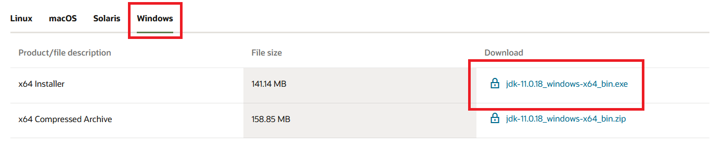
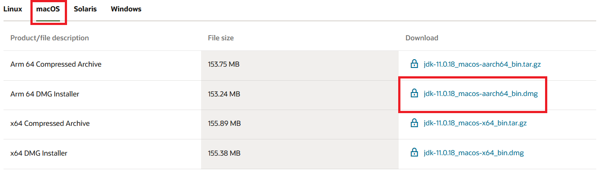

# User Guide

# Introduction

Thank you for your interest in MoneyGoWhere! This user guide aims to show off the features of the application and how to
use it.

MoneyGoWhere is a point-of-sale, desktop app for tracking sales and inventory, optimised for use via a Command line
Interface (CLI). With the ability to type fast and with familiarity of the system, you will be able to quickly track
sales, check inventory and calculate change. This CLI application is comparable with Graphical User Interface (GUI)
applications due to its low-cost and adaptability.

This application is primarily tailored towards the hawker stall owners at The Deck in National University of Singapore.

<br>

# Using This Guide

This guide is split into **two** main sections:

* [Advanced](#advanced-guide), and
* [Basic](#basic-guide)

Each guide covers two types of commands, those relating to items and those relating to orders.

The functionality between advanced and basic is exactly the same. However, the advanced mode allows for a command to be
sent in a single line, while the basic mode brings you through the process step-by-step. In each section, the styling
format used can be found in the command section.

If you are a returning user or extremely proficient in computers, we recommend the advanced guide. However, if you are
new to MoneyGoWhere, or less proficient in computers, we recommend the basic guide.

Additionally, MoneyGoWhere has a [statistics feature](#statistics-feature) which allows you to generate reports based on
your sales.

<br>

# General Table of Contents

* [Introduction](#introduction)
* [Using This Guide](#using-this-guide)
* [Table of Contents](#general-table-of-contents)
* [Advanced Guide](#advanced-guide)
* [Basic Guide](#basic-guide)
* [Statistics Feature](#statistics-feature)
* [Save File](#save-file)
* [Glossary](#glossary)

# Advanced Guide

This version of our guide will bring you through how to use the features of MoneyGoWhere in a single command.

To see the beginner's version, [please click here](#basic-guide).

Note that all functionality is the same, regardless of the mode used.

## Table of Contents

1. [Quick Setup](#quick-setup)
2. [Features](#advanced-commands)
    1. [Help](#advanced-help)
    2. [Items](#advanced-mode-items)
        * [Add Items](#advanced-mode-add-an-item)
        * [Delete Items](#advanced-mode-delete-an-item)
        * [List Items](#advanced-mode-list-all-items)
        * [Find Items](#advanced-mode-find-an-item)
        * [Update Items](#advanced-mode-update-an-item)
    3. [Orders](#advanced-mode-orders)
        * [Add Order](#advanced-mode-add-an-order)
            * [Single Item](#advanced-mode-single-item)
            * [Multiple Items](#advanced-mode-multiple-items)
        * [List all Orders](#advanced-mode-list-all-orders)
        * [Refund an Order](#advanced-mode-refund-an-order)

<br>

## Quick Setup

Need more help? [Click here to see our detailed guide!](#setting-up-moneygowhere)

1. Ensure you have Java 11 installed,
   and [download the latest release of MoneyGoWhere](https://github.com/AY2223S2-CS2113T-T09-2/tp/releases) and place it
   in a folder.

   

2. Open the command terminal and navigate to the folder where the `.jar` file is, by doing `cd "<file path>"`.
3. Use the command `java -jar moneygowhere.jar` to launch our application. If correct, you should see the following on
   startup:

    ```text
    ░█▀▄▀█ █▀▀█ █▀▀▄ █▀▀ █──█ ░█▀▀█ █▀▀█ ░█──░█ █──█ █▀▀ █▀▀█ █▀▀
    ░█░█░█ █──█ █──█ █▀▀ █▄▄█ ░█─▄▄ █──█ ░█░█░█ █▀▀█ █▀▀ █▄▄▀ █▀▀
    ░█──░█ ▀▀▀▀ ▀──▀ ▀▀▀ ▄▄▄█ ░█▄▄█ ▀▀▀▀ ░█▄▀▄█ ▀──▀ ▀▀▀ ▀─▀▀ ▀▀▀
    Welcome to MoneyGoWhere!
        
    Please enter a command:
    ```

4. When you are done using MoneyGoWhere, you can exit the application with the command `exit`.

[Return back to Advanced Guide](#advanced-guide) | [Go to Advanced Mode Items](#advanced-mode-items) | [Go to Advanced Mode Orders](#advanced-mode-orders) | [Go to Basic Guide](#basic-guide)

<br>

## Advanced Commands

* Note that all command options have multiple methods of input. For example, the option for name when adding an item can
  be signified by the flag `-n` or `--name`. More details are given in each command.
    * All of these command options are **case-sensitive**.
    * All examples will be given with the short-form flag, as it is the preferred method of input. However, the longer
      version will also be provided.
    * To use the long-form flag, just replace the short-form flag.
* All options are signified by `<example>`, which means you can change it according to what you need. Options wrapped
  in `{}` are optional, such as in [Multiple Items](#advanced-mode-multiple-items).
* In all the examples, the use of `>` signifies a user input. Normal text is _italicised_ to signify the options that
  will be used as the command.
* In advanced mode, all commands are prefixed with `/`, to distinguish them from the basic commands. Without the
  inclusion of this character, commands will be interpreted as a [basic command](#basic-commands).

[Return back to Advanced Guide](#advanced-guide) | [Go to Advanced Mode Items](#advanced-mode-items) | [Go to Advanced Mode Orders](#advanced-mode-orders) | [Go to Basic Guide](#basic-guide)

<br>

### Advanced Help

Entering this command will show you a list of all available commands.

Note that it is possible to use the given index as a command input, but doing so will execute commands as if you were
using the [basic mode](#basic-guide). To use these commands as in advanced mode, append a `/` at the beginning of the
command, along with the proper flags, as explained in the next few sections.

Format: `help`

The output of running the `help` command is as follows:

```text
Please enter a command: 
> help
There are 8 commands you can use in MoneyGoWhere. For more details, please refer to the user guide.
1. additem
2. deleteitem
3. listitem
4. updateitem
5. finditem
6. addorder
7. listorder
8. refundorder
```

[Return back to Advanced Guide](#advanced-guide) | [Go to Advanced Mode Items](#advanced-mode-items) | [Go to Advanced Mode Orders](#advanced-mode-orders) | [Go to Basic Guide](#basic-guide)

<br>
<hr style="height:3px; background-color:black ;border:none; width:60%; text-align:center; margin: 0 auto;">
<br>

### Advanced Mode Items

There are five different commands you can run for items.

* [Add an Item](#advanced-mode-add-an-item)
* [Delete an Item](#advanced-mode-delete-an-item)
* [List all Items](#advanced-mode-list-all-items)
* [Find an Item](#advanced-mode-find-an-item)
* [Update an Item](#advanced-mode-update-an-item)

### Advanced Mode Add an Item

This adds a new item to the menu. New items must have a name and price.

Format: `/additem -n "<name>" -p <price>` or `/additem --name "<name>" --price <price>`

* Name refers to the name of the item
    * It is case-insensitive
    * It has an upper limit of 25 characters
    * Names are unique, regardless of how the words are capitalized. `Chicken` and `chicken` will count as the same
      word.
* Price refers to the price of the item
    * It can have up to two decimal places (`2`, `2.1`, `2.22` are all valid inputs).

**Examples of Usage**

* You want to add a new item, _Chicken Rice_, which costs _$3.55_. To do so, use the
  command `/additem -n "Chicken Rice" -p 3.55`.

```text
Please enter a command: 
> /additem -n "Chicken Rice" -p 3.55
The command: /additem was successfully executed!
```

* You want to add a new item, _Egg_, which costs _$0.80_. To do so, use the command `/additem -n "Egg" -p 0.8`,
  or `/additem -n "Egg" -p 0.80`.

```text
Please enter a command: 
> /additem -n "Egg" -p 0.8
The command: /additem was successfully executed!
```

[Return back to Advanced Guide](#advanced-guide) | [Go to Advanced Mode Items](#advanced-mode-items) | [Go to Advanced Mode Orders](#advanced-mode-orders) | [Go to Basic Guide](#basic-guide)

<br>
<hr style="height:3px; background-color:black ;border:none; width:60%; text-align:center; margin: 0 auto;">
<br>

### Advanced Mode Delete an Item

This removes an item from the menu, identified by its index when [listing all items](#advanced-mode-list-all-items).

Format: `/deleteitem -i <index>` or `/deleteitem --index <index>`

* The index must be a valid number.

Note that deleting an item will affect the index of all other items.

**Example of Usage**

* You change your mind and no longer want to sell _Chicken Rice_. [Looking at the menu](#advanced-mode-list-all-items),
  you find that the index of _Chicken Rice_ is _0_. To delete Chicken Rice, use the command `/deleteitem -i 0`.

```text
Please enter a command: 
> /deleteitem -i 0
The command: /deleteitem was successfully executed!
```

[Return back to Advanced Guide](#advanced-guide) | [Go to Advanced Mode Items](#advanced-mode-items) | [Go to Advanced Mode Orders](#advanced-mode-orders) | [Go to Basic Guide](#basic-guide)

<br>
<hr style="height:3px; background-color:black ;border:none; width:60%; text-align:center; margin: 0 auto;">
<br>

### Advanced Mode List all Items

This lists all items currently in the menu.

Note that the index is important as it is the reference for [adding Orders](#advanced-mode-add-an-order).

Format: `/listitem`

* This command accepts no additional parameters. Even if additional parameters are listed, they will be ignored.

**Examples of Usage**

* List all items currently in menu, using the command `/listitem`

```text
Please enter a command: 
> /listitem
| Index | Name                      | Price |
| ----- | ------------------------- | ----- |
| 0     | Chicken Rice              | 3.55  |
| 1     | Egg                       | 0.80  |
The command: listitem was successfully executed!
```

[Return back to Advanced Guide](#advanced-guide) | [Go to Advanced Mode Items](#advanced-mode-items) | [Go to Advanced Mode Orders](#advanced-mode-orders) | [Go to Basic Guide](#basic-guide)

<br>
<hr style="height:3px; background-color:black ;border:none; width:60%; text-align:center; margin: 0 auto;">
<br>

### Advanced Mode Find an Item

This command is used to find any and all items that match your input. It will give you the item's index, full name, and
price.

Format: `/finditem <partial name>`

* The partial name is case-insensitive.

**Example of Usage**

```text
Please enter a command: 
> /listitem
| Index | Name                      | Price |
| ----- | ------------------------- | ----- |
| 0     | Chicken Rice              | 3.55  |
| 1     | Egg                       | 0.80  |
| 2     | Whole Roast Chicken       | 16.00 |
| 3     | Laksa                     | 3.55  |
| 4     | Fried Rice                | 5.00  |
| 5     | Mee Goreng                | 4.50  |
| 6     | Whole White Chicken       | 16.00 |
The command: listitem was successfully executed!
Please enter a command: 
> /finditem Chicken
| Index | Name                      | Price |
| ----- | ------------------------- | ----- |
| 0     | Chicken Rice              | 3.55  |
| 2     | Whole Roast Chicken       | 16.00 |
| 6     | Whole White Chicken       | 16.00 |
The command: /finditem was successfully executed!
```

[Return back to Advanced Guide](#advanced-guide) | [Go to Advanced Mode Items](#advanced-mode-items) | [Go to Advanced Mode Orders](#advanced-mode-orders) | [Go to Basic Guide](#basic-guide)

<br>
<hr style="height:3px; background-color:black ;border:none; width:60%; text-align:center; margin: 0 auto;">
<br>

### Advanced Mode Update an Item

If you make a mistake when entering details for one of your items, you can update it with this command. The index of the
item will not change.

Format `/updateitem -i <index> {-n "<name>"} {-p <price>}`

* The index refers to corresponding index when you use the command `/listitem`.
* The name refers to the new name of the item.
* The price refers to the new name of the price.
* For each execution of `/updateitem`, you can update the name and/or price of the item. You must update at least one
  detail for the command to work.

**Example of Usage**

Assume your menu currently looks like this:

```text
| Index | Name                      | Price |
| ----- | ------------------------- | ----- |
| 0     | Egg                       | 0.08  |
| 1     | Laksa                     | 3.55  |
| 2     | Fried Ric                 | 2.00  |
| 3     | Mee Goreng                | 4.50  |
| 4     | Wantom Mee                | 4.00  |
```

You realize three things:

1. The price of _Egg_ should be _$0.80_.
2. _Wantom Mee_ should be spelt _Wanton Mee_.
3. _Fried Ric_ should be formatted properly as _Fried Rice_, and its price should be _$4_.

Assuming the following examples are sequential. So, example 2 is completed after example 1, and example 3 is completed
after example 1 and 2.

**Example 1: Updating the Price**

To fix the first issue, use the command `/updateitem -i 0 -p 0.80`.

After this command, the menu will be updated to:

```text
Please enter a command: 
> /updateitem -i 0 -p 0.80
The command: /updateitem was successfully executed!
Please enter a command: 
> /listitem
| Index | Name                      | Price |
| ----- | ------------------------- | ----- |
| 0     | Egg                       | 0.80  |
| 1     | Laksa                     | 3.55  |
| 2     | Fried Ric                 | 2.00  |
| 3     | Mee Goreng                | 4.50  |
| 4     | Wanton M                  | 4.00  |
The command: listitem was successfully executed!
```

**Example 2: Updating the Name**

To fix the second issue, use the command `/updateitem -i 4 -n "Wanton Mee"`

After this command, the menu will be updated to:

```text
Please enter a command: 
/updateitem -i 4 -n "Wanton Mee"
The command: /updateitem was successfully executed!
Please enter a command: 
/listitem
| Index | Name                      | Price |
| ----- | ------------------------- | ----- |
| 0     | Egg                       | 0.80  |
| 1     | Laksa                     | 3.55  |
| 2     | Fried Ric                 | 2.00  |
| 3     | Mee Goreng                | 4.50  |
| 4     | Wanton Mee                | 4.00  |
The command: listitem was successfully executed!
```

**Example 3: Updating the Name and Price**

To fix the third issue, use the command `/updateitem -i 2 -n "Fried Rice" -p 4`

After this command, the menu will be updated to:

```text
Please enter a command: 
> /updateitem -i 2 -n "Fried Rice" -p 4
The command: /updateitem was successfully executed!
Please enter a command: 
> /listitem
| Index | Name                      | Price |
| ----- | ------------------------- | ----- |
| 0     | Egg                       | 0.80  |
| 1     | Laksa                     | 3.55  |
| 2     | Fried Rice                | 4.00  |
| 3     | Mee Goreng                | 4.50  |
| 4     | Wanton Mee                | 4.00  |
The command: listitem was successfully executed!
```

[Return back to Advanced Guide](#advanced-guide) | [Go to Advanced Mode Items](#advanced-mode-items) | [Go to Advanced Mode Orders](#advanced-mode-orders) | [Go to Basic Guide](#basic-guide)

<br>
<hr style="height:3px; background-color:black ;border:none; width:60%; text-align:center; margin: 0 auto;">
<br>

### Advanced Mode Orders

There are three different commands you can run for orders. It is highly recommended that you read the
entire [Add an Order](#advanced-mode-add-an-order) section as they are all related.

* [Add an Order](#advanced-mode-add-an-order)
    * [Add a Single Item to an Order](#advanced-mode-single-item)
    * [Add Multiple Items to an Order](#advanced-mode-multiple-items)
    * [Searching by Name](#advanced-mode-search-by-name)
* [List all Orders](#advanced-mode-list-all-orders)

### Advanced Mode Add an Order

When you add an order, the total price will be given. Afterwards, you have to add the amount paid, as well as the method
of payment.

After adding the order, you will be prompted to add the payment, which can be done with `/pay -a <amount> -t <type>`
or `/pay --amount <amount> --type <type>`

* `Amount` refers to the amount paid, with up to 2 decimal places. (`2`, `2.1`, and `2.22` are all valid inputs).
* `Type` must use one of the following three modes: `Card`, `Cash` or `Others`.
      * It is case-insensitive

[Return back to Advanced Guide](#advanced-guide) | [Go to Advanced Mode Items](#advanced-mode-items) | [Go to Advanced Mode Orders](#advanced-mode-orders) | [Go to Basic Guide](#basic-guide)

<br>
<hr style="height:3px; background-color:black ;border:none; width:60%; text-align:center; margin: 0 auto;">
<br>


#### Advanced Mode Single Item

This mode of input allows you to add an order with a single item with ease.

**It is highly recommended to read the entire [`Add an Order` section](#advanced-mode-add-an-order), as details for
the `/pay` command is not addressed here, and all different modes of payment will be covered across both sections of
adding orders.**

Format: `/addorder -i <index> -q <quantity>` or `/addorder --index <index> --quantity <quantity>`

* The `index` refers to the index obtained when printing [all items](#advanced-mode-list-all-items).
* The quantity must be a positive whole number.
* Repeated sets of index and quantity must be separated by a comma.

**Example of Usage**
**Example 1 - Cash Payment**
Assume your menu is as follows:

```text
| Index | Name                      | Price |
| ----- | ------------------------- | ----- |
| 0     | Egg                       | 0.80  |
| 1     | Laksa                     | 3.55  |
| 2     | Fried Rice                | 4.00  |
| 3     | Mee Goreng                | 4.50  |
| 4     | Wanton Mee                | 4.00  |
```

* You have a customer, who wants to order _2_ plates of _Fried Rice_. To add their order, use the
  command `/addorder -i 3 -q 2`

```text
Please enter a command: 
> /addorder -i 3 -q 2
Order has been added successfully. Total amount: $9.00.
Please use /pay command to add payment for the order.
```

You tell them the total amount is _$9.00_, and they give you _$10_ in _cash_. So, you input `/pay -a 10 -t cash`, and
obtain the following result:

```text
Please use /pay command to add payment for the order.
> /pay -a 10 -t cash
The calculated change is $1.00.
The command: /pay was successfully executed!
```

**Example 2 - Card Payment**

* The next customer orders _3_ bowls of _Laksa_. This time, they want to pay with their card (the amount paid is exact).
  So you input `/addorder -i 1 -q 3`.

```text
Please enter a command: 
> /addorder -i 1 -q 3
Order has been added successfully. Total amount: $10.65.
Please use /pay command to add payment for the order.
```

Next, you use the command `/pay -a 10.65 -t card` and obtain the following result:

```text
Please use /pay command to add payment for the order.
> /pay -a 10.65 -t card
The command: /pay was successfully executed!
```

[Return back to Advanced Guide](#advanced-guide) | [Go to Advanced Mode Items](#advanced-mode-items) | [Go to Advanced Mode Orders](#advanced-mode-orders) | [Go to Basic Guide](#basic-guide)

<br>
<hr style="height:3px; background-color:black ;border:none; width:60%; text-align:center; margin: 0 auto;">
<br>


#### Advanced Mode Multiple Items

This command allows you to add multiple items to a single order.

Format: `/addorder -I [<index>:<quantity>{,<index>:<quantity>}`

* You need at least one set of `<index>:<quantity>`. Multiple sets need to be separated by commands, without spaces.
    * Additional sets of index and quantity are
* The same item can be input multiple times.

**It is highly recommended to read the entire [`Add an Order` section](#advanced-mode-add-an-order), as details for
the `/pay` command is not addressed here, and all different modes of payment will be covered across both sections of
adding orders.**

**Example of Usage:**

Assume your menu is as follows:

```text
| Index | Name                      | Price |
| ----- | ------------------------- | ----- |
| 0     | Egg                       | 0.80  |
| 1     | Laksa                     | 3.55  |
| 2     | Fried Rice                | 4.00  |
| 3     | Mee Goreng                | 4.50  |
| 4     | Wanton Mee                | 4.00  |
```

A large group comes to your store and orders _2_ bowls of _Laksa_, _3_ plates of _Fried Rice_, and _2_ plates of Wanton
Mee. At the last moment, your customer adds another _2_ bowls of _Laksa_. This customer uses a voucher to pay (an "
_others_" mode of payment). To add this lengthy order, you can use the command `/addorder -I [1:2,2:3,2:4,1:2]`.

```text
Please enter a command: 
> /addorder -I [1:2,2:3,4:2,1:2]
Order has been added successfully. Total amount: $42.20.
Please use /pay command to add payment for the order.
> /pay -a 42.20 -t others
The calculated change is $0.0.
The command: /pay was successfully executed!
```

[Return back to Advanced Guide](#advanced-guide) | [Go to Advanced Mode Items](#advanced-mode-items) | [Go to Advanced Mode Orders](#advanced-mode-orders) | [Go to Basic Guide](#basic-guide)

<br>
<hr style="height:3px; background-color:black ;border:none; width:60%; text-align:center; margin: 0 auto;">
<br>

#### Advanced Mode Search by Name

Forgot the index of an item? Fret not! You can also add an item to an order by searching its name.

* For single items, use the command `/addorder -i "<name>" -q <quantity>`
* For multiple items, use the command `/addorder -I ["<name>":q{,"<name>":q}]`
    * Like in the previous section, Advanced Mode Multiple Items, the command requires a minimum of one item and its
      corresponding quantity.
    * Different items are split by a comma.

**Example of Usage**

**Single Item Order**

```text
Please enter a command: 
/addorder -i "laksa" -q 2
Order has been added successfully. Total amount: $7.1.
Please use /pay command to add payment for the order.
/pay -a 7.1 -t card
The calculated change is $0.0.
The command: /pay was successfully executed!
```

**Multiple Items Order**

```text
Please enter a command: 
/addorder -I ["laksa":2,"mee goreng":4]
Order has been added successfully. Total amount: $25.1.
Please use /pay command to add payment for the order.
/pay -a 25.1 -t cash
The calculated change is $0.0.
The command: /pay was successfully executed!
```

[Return back to Advanced Guide](#advanced-guide) | [Go to Advanced Mode Items](#advanced-mode-items) | [Go to Advanced Mode Orders](#advanced-mode-orders) | [Go to Basic Guide](#basic-guide)

<br>
<hr style="height:3px; background-color:black ;border:none; width:60%; text-align:center; margin: 0 auto;">
<br>

### Advanced Mode List all Orders

After adding many orders, you may wish to view a list of all transactions.

Format: `/listorder`

**Example of Usage**

```text
> /listorder
================================================
Order 1
Order ID: f5fda17b-a520-4ea0-a42a-cefa6c9315d7
Order status: COMPLETED
Order time: 2023-03-20 16:01:40
1. Laksa x2
2. Fried Rice x3
3. Wanton Mee x2
4. Laksa x2

Subtotal: $34.20
================================================
Order 2
Order ID: ffc76ebe-09b1-48d2-9378-af49c234f399
Order status: COMPLETED
Order time: 2023-03-20 15:16:52
1. Mee Goreng x2

Subtotal: $9.00
================================================
```

The above example is just a small extract from a long list of transactions and is non-exhaustive.

The Order ID is important as it is used for [refunding orders](#advanced-mode-refund-an-order).

[Return back to Advanced Guide](#advanced-guide) | [Go to Advanced Mode Items](#advanced-mode-items) | [Go to Advanced Mode Orders](#advanced-mode-orders) | [Go to Basic Guide](#basic-guide)

<br>
<hr style="height:3px; background-color:black ;border:none; width:60%; text-align:center; margin: 0 auto;">
<br>

### Advanced Mode Refund An Order

If you made a mistake in an order, or wish to refund a customer's order, you may do so with this feature.

Format: `/refundorder <order ID>`.

* The order ID refers to the order ID given from [printing the list of orders](#advanced-mode-list-all-orders) or
  the `orders.json` file.
    * You cannot refund an order that has already been refunded.
    * The ID can be copied and pasted from and into the CLI for ease of use.

More information about data storage and `.json` files can be found [here](#save-file).

**Example of Usage**
Assume you want to refund the following order.

```text
================================================
Order 2
Order ID: ffc76ebe-09b1-48d2-9378-af49c234f399
Order status: COMPLETED
Order time: 2023-03-20 15:16:52
1. Mee Goreng x2

Subtotal: $9.00
================================================
```

To refund it, you use the command `/refundorder ffc76ebe-09b1-48d2-9378-af49c234f399`.

```text
Please enter a command: 
> /refundorder ffc76ebe-09b1-48d2-9378-af49c234f399
The command: /refundorder was successfully executed!
```

This changes the status of the order to _REFUNDED_.

```text
================================================
Order 2
Order ID: ffc76ebe-09b1-48d2-9378-af49c234f399
Order status: REFUNDED
Order time: 2023-03-20 15:16:52
1. Mee Goreng x2

Subtotal: $9.00
================================================
```

[Return back to Advanced Guide](#advanced-guide) | [Go to Advanced Mode Items](#advanced-mode-items) | [Go to Advanced Mode Orders](#advanced-mode-orders) | [Go to Basic Guide](#basic-guide)

<br>
<hr style="height:3px; background-color:black ;border:none; width:60%; text-align:center; margin: 0 auto;">
<br>

## Advanced Mode Command Summary

Note that the long version of the commands, for example `--name` instead of `-name` will be omitted as it is not the
preferred mode of input.

| Command Type                  | General Format                                           | Example                                                                                                    |
|-------------------------------|----------------------------------------------------------|------------------------------------------------------------------------------------------------------------|
| Help                          | `help`                                                   | `help`                                                                                                     |
| Add an item                   | `/additem -n "<name>" -p <price>`                        | `/additem -n "Chicken Rice" -p 3.5`                                                                        |
| Delete an item                | `/deleteitem -i <index>`                                 | `/deleteitem -i 0`                                                                                         |
| List an Item                  | `/listitem`                                              | `/listitem`                                                                                                |
| Find an Item                  | `/finditem <description>`                                | `/finditem "Chicken R"`                                                                                    |
| Update an Item                | `/updateitem -i <index> {-n "<name>"} {-p <price>}`      | `/updateitem -i 2 -n "Laksa"` <br> `/updateitem -i 3 -p 3.55` <br> `/updateitem -i 1 -n "Fried Rice" -p 5` |
| Add an Order (Single Item)    | `/addorder -i {index} -q {quantity}`                     | `/addorder -i 10 -q 5` <br> `/addorder -i "Chicken Ri" -q 5`                                               |
| Add an Order (Multiple Items) | `/addorder -I [<index>:<quantity>{,<index>:<quantity>}]` | `/addorder -I [1:3,"Chicken Ri":5,6:2]`                                                                    |
| List an Order                 | `/listorder`                                             | `/listorder`                                                                                               | 
| Refund an Order               | `/refundorder <ID>`                                      | `/refundorder ffc76ebe-09b1-48d2-9378-af49c234f399`                                                        |

[Return back to Advanced Guide](#advanced-guide) | [Go to Advanced Mode Items](#advanced-mode-items) | [Go to Advanced Mode Orders](#advanced-mode-orders) | [Go to Basic Guide](#basic-guide)

<br>
<hr style="height:3px; background-color:black ;border:none; text-align:center; margin: 0 auto;">
<br>

# Basic Guide

This version of our guide will bring you through how to use the many features of MoneyGoWhere, in basic mode. In this
mode, you will be prompted step-by-step to use the various features and complete commands.
To see the advanced version, [please click here](#advanced-guide).

Note that all functionality is the same, regardless of the mode used.

## Table of Contents

1. [Setting up MoneyGoWhere](#setting-up-moneygowhere)
2. [Basic Commands](#basic-commands)
    1. [Help](#basic-help)
    2. [Items](#basic-mode-items)
        * [Add Items](#basic-mode-add-an-item)
        * [Delete Items](#basic-mode-delete-an-item)
        * [List all Items](#basic-mode-list-all-items)
        * [Find an Item](#basic-mode-find-an-item)
        * [Update an Item](#basic-mode-update-an-item)
    3. [Orders](#basic-mode-orders)
        * [Add an Order](#basic-mode-add-an-order)
        * [List all Orders](#basic-mode-list-all-orders)
        * [Refund an order](#basic-mode-refund-an-order)
3. [Command Summary](#basic-mode-command-summary)

<br>

## Setting up MoneyGoWhere

1. Before installing and using MoneyGoWhere, do note that Java 11 is required. If you do not already have it installed,
   you can do so [here](https://www.oracle.com/sg/java/technologies/downloads/#java11)
    * For Windows users, download the x64 Installer.
      
    * For Mac users, download the ARM 64 DMG Installer.
      
2. After installing Java 11, please download the `.jar`
   file [here](https://github.com/AY2223S2-CS2113T-T09-2/tp/releases) and place it in a folder. Doing so ensures that
   the save-file will not be lost, allowing you to use data that you have previously entered. Click
   on `MoneyGoWhere.jar` to automatically download the file. Ensure that it is the latest version.
   

6. Open a command terminal by entering `cmd` in your start menu.
7. In the terminal, navigate to the location of the folder by doing `cd "<file path>"`.
    - This step is important as it ensures that the saved tasks file will be saved in the same directory. Otherwise, the
      file will be stored in the current working directory.
8. Use the command `java -jar MoneyGoWhere.jar` to launch MoneyGoWhere. If done correctly, you will see something like
   this on your first start up:

    ```text
    ░█▀▄▀█ █▀▀█ █▀▀▄ █▀▀ █──█ ░█▀▀█ █▀▀█ ░█──░█ █──█ █▀▀ █▀▀█ █▀▀
    ░█░█░█ █──█ █──█ █▀▀ █▄▄█ ░█─▄▄ █──█ ░█░█░█ █▀▀█ █▀▀ █▄▄▀ █▀▀
    ░█──░█ ▀▀▀▀ ▀──▀ ▀▀▀ ▄▄▄█ ░█▄▄█ ▀▀▀▀ ░█▄▀▄█ ▀──▀ ▀▀▀ ▀─▀▀ ▀▀▀
    Welcome to MoneyGoWhere!
        
    Please enter a command:
    ```

9. When you are done using the app, enter `exit` to shut the application down. This ensures that Duke will save your
   data, as saving data is only done during the shut-down process.

[Return back to Basic Guide](#basic-guide) | [Go to Basic Mode Items](#basic-mode-items) | [Go to Basic Mode Orders](#basic-mode-orders) | [Go to Advanced Guide](#advanced-guide)

<br>
<hr style="height:3px; background-color:black ;border:none; width:60%; text-align:center; margin: 0 auto;">
<br>

## Basic Commands

* All options are signified by `<example>`, which means you can change it according to what you need.
* In all the examples, the use of `>` signifies a user input. Normal text is _italicised_ to signify the options that
  will be used as the command.
* In advanced mode, all commands are prefixed with `/`, to distinguish them from the basic commands. To view advanced
  commands, [click here](#advanced-guide)

[Return back to Basic Guide](#basic-guide) | [Go to Basic Mode Items](#basic-mode-items) | [Go to Basic Mode Orders](#basic-mode-orders) | [Go to Advanced Guide](#advanced-guide)

<br>

### Basic Help

Entering this command will show you a list of all available commands.

Note that it is possible to use the given index as a command input, but doing so will execute commands in basic mode.

Format: `help`

The output of running the `help` command is as follows:

```text
Please enter a command: 
> help
There are 8 commands you can use in MoneyGoWhere. For more details, please refer to the user guide.
1. additem
2. deleteitem
3. listitem
4. updateitem
5. finditem
6. addorder
7. listorder
8. refundorder
```

[Return back to Basic Guide](#basic-guide) | [Go to Basic Mode Items](#basic-mode-items) | [Go to Basic Mode Orders](#basic-mode-orders) | [Go to Advanced Guide](#advanced-guide)

<br>
<hr style="height:3px; background-color:black ;border:none; width:60%; text-align:center; margin: 0 auto;">
<br>

### Basic Mode Items

* [Add an Item](#basic-mode-add-an-item)
* [Delete an Item](#basic-mode-delete-an-item)
* [List all Items](#basic-mode-list-all-items)
* [Update an Item](#basic-mode-update-an-item)
* [Find an Item](#basic-mode-find-an-item)

### Basic Mode Add an Item

Format: `additem` or `1`

This allows you to add an item to the menu, where you will be prompted to input the name, then the price of the item.

**Example of Usage**

If you want to add _Chicken Rice_, which costs _$3.50_ to your menu, you can use `additem` to begin the process of
adding it to your menu.

```text
Please enter a command: 
> additem
Please enter the item's name: 
> Chicken Rice
Please enter the item's price: 
> 3.50
Item added successfully.
```

[Return back to Basic Guide](#basic-guide) | [Go to Basic Mode Items](#basic-mode-items) | [Go to Basic Mode Orders](#basic-mode-orders) | [Go to Advanced Guide](#advanced-guide)

<br>
<hr style="height:3px; background-color:black ;border:none; width:60%; text-align:center; margin: 0 auto;">
<br>

### Basic Mode Delete an Item

Format: `deleteitem` or `2`.

This allows you to delete an item from the menu, where you will be asked to input the index of the item to be deleted.

Note that deleting an item will affect the index of all other items.

**Example of Usage**

Assume your menu currently looks like this.

```text
| Index | Name                      | Price |
| ----- | ------------------------- | ----- |
| 0     | Chicken Rice              | 3.50  |
```

You change your mind and decide you no longer want to sell Chicken Rice, which is at index _0_. To begin the process of
deleting it from your menu, you can use the command `deleteitem`.

```text
Please enter a command: 
> deleteitem
Please enter the item's index: 
> 0
Item deleted successfully.
```

[Return back to Basic Guide](#basic-guide) | [Go to Basic Mode Items](#basic-mode-items) | [Go to Basic Mode Orders](#basic-mode-orders) | [Go to Advanced Guide](#advanced-guide)

<br>
<hr style="height:3px; background-color:black ;border:none; width:60%; text-align:center; margin: 0 auto;">
<br>

### Basic Mode List all Items

Format: `listitem` or `3`

This allows you to list all items in the menu. It accepts no additional input.

**Example of Usage**

```text
Please enter a command: 
> listitem
| Index | Name                      | Price |
| ----- | ------------------------- | ----- |
| 0     | Chicken Rice              | 3.50  |
| 1     | Fried Rice                | 5.00  |
| 2     | Mee Goreng                | 5.00  |
| 3     | Fish Soup                 | 6.50  |
All items in the menu have been listed!
```

[Return back to Basic Guide](#basic-guide) | [Go to Basic Mode Items](#basic-mode-items) | [Go to Basic Mode Orders](#basic-mode-orders) | [Go to Advanced Guide](#advanced-guide)

<br>
<hr style="height:3px; background-color:black ;border:none; width:60%; text-align:center; margin: 0 auto;">
<br>

### Basic Mode Update an Item

Format: `updateitem` or `4`

This allows you to update the name and/or price of the item. You will be prompted to enter the index, then the option to
change the item's name, then price.

**Example of Usage**

To show all different ways of updating an item, assume your menu looks like this.

```text
| Index | Name                      | Price |
| ----- | ------------------------- | ----- |
| 0     | chicken Rice              | 3.50  |
| 1     | Egg                       | 80.00 |
| 2     | mEE gORENG                | 56.00 |
```

You want to change 3 things:

1. Change the name to "_Chicken Rice_" at Index _0_.
2. Change the price to _$0.80_ at Index _1_.
3. Change the name to "_Mee Goreng_" and change the price to _$5.60_ at Index _2_.

To do so, use the command `updateitem`.

**Example 1: Change the Name**

```text
Please enter a command: 
> updateitem
Please enter the item's index: 
> 0
Would you like to update item name? (yes/no)
> yes
Please enter the item's name: 
> Chicken Rice
Would you like to update item price? (yes/no)
> no
Item updated successfully.
```

**Example 2: Change the Price**

```text
Please enter a command: 
> updateitem
Please enter the item's index: 
> 1
Would you like to update item name? (yes/no)
> no
Would you like to update item price? (yes/no)
> yes
Please enter the item's price: 
> 0.80
Item updated successfully.
```

**Example 3: Change Name and Price**

```text
Please enter a command: 
> updateitem
Please enter the item's index: 
> 2
Would you like to update item name? (yes/no)
> yes
Please enter the item's name: 
> Mee Goreng
Would you like to update item price? (yes/no)
> yes
Please enter the item's price: 
> 5.60
Item updated successfully.
```

[Return back to Basic Guide](#basic-guide) | [Go to Basic Mode Items](#basic-mode-items) | [Go to Basic Mode Orders](#basic-mode-orders) | [Go to Advanced Guide](#advanced-guide)

<br>
<hr style="height:3px; background-color:black ;border:none; width:60%; text-align:center; margin: 0 auto;">
<br>

### Basic Mode Find an Item

Format: `finditem` or `5`

This allows you to find an item. You will be prompted to input the full or partial name of a string. A list of all items
in the menu matching the input will be printed.

Entering `finditem` on its own will achieve the same effect as [`listitem`](#basic-mode-list-all-items).

Note that the input is not case-sensitive. Entering `chicken` and `Chicken` will have the same effect.

**Example of Usage**

Assume your menu looks like this.

```text
| Index | Name                      | Price |
| ----- | ------------------------- | ----- |
| 0     | Chicken Rice              | 3.50  |
| 1     | Fried Rice                | 5.00  |
| 2     | Mee Goreng                | 5.00  |
| 3     | Fish Soup                 | 6.50  |
```

You temporarily forget which items on your menu have "_rice_" in the name. To search for all of them, use the
command `finditem`.

```text
Please enter a command: 
> finditem
Please enter the keyword to search for: 
> rice
| Index | Name                      | Price |
| ----- | ------------------------- | ----- |
| 0     | chicken Rice              | 3.50  |
| 1     | Fried Rice                | 5.00  |
finditem completed!
```

[Return back to Basic Guide](#basic-guide) | [Go to Basic Mode Items](#basic-mode-items) | [Go to Basic Mode Orders](#basic-mode-orders) | [Go to Advanced Guide](#advanced-guide)

<br>
<hr style="height:3px; background-color:black ;border:none; width:60%; text-align:center; margin: 0 auto;">
<br>

### Basic Mode Orders

* [Add an Order](#basic-mode-add-an-order)
* [List all Orders](#basic-mode-list-all-orders)
* [Refund an Order](#basic-mode-refund-an-order)

### Basic Mode Add an Order

Format: `addorder` or `6`

This allows you to add an order. You will be prompted to first input the name or index of the item, then the quantity.
After each set of item and quantity, you will be asked if you want to add more items to the order. After adding all
items, you will be prompted to input payment.

Note that the payment type can be one of the following 3 types:

* Cash
* Card
* Others

**Example of Usage**

Assume your menu looks like this:

```text
| Index | Name                      | Price |
| ----- | ------------------------- | ----- |
| 0     | Egg                       | 0.80  |
| 1     | Mee Goreng                | 5.60  |
| 2     | Pasta                     | 10.00 |
| 3     | Chicken Rice              | 5.00  |
```

A customer orders _2_ plates of _Chicken Rice_ and _5_ bowls of _Pasta_. Use the command `addorder` to add their order.

```text
Please enter a command: 
> addorder
Please enter the item's name or index: 
> chicken rice
Please enter the quantity of the item: 
> 2
Do you have more items to add? (yes/no/cancel)
> yes
Please enter the item's name or index: 
> 2
Please enter the quantity of the item: 
> 5
Do you have more items to add? (yes/no/cancel)
> no
Order added successfully!

Subtotal: $60.00
Order has been added successfully. Total amount: $60.00
Please use /pay -a <amount> -t <type> or pay to make payment.
> pay
Please enter amount to pay.
> 60
Please enter payment type.
> cash
The command: addorder was successfully executed!
```

[Return back to Basic Guide](#basic-guide) | [Go to Basic Mode Items](#basic-mode-items) | [Go to Basic Mode Orders](#basic-mode-orders) | [Go to Advanced Guide](#advanced-guide)

<br>
<hr style="height:3px; background-color:black ;border:none; width:60%; text-align:center; margin: 0 auto;">
<br>

### Basic Mode List all Orders

Format: `listorder` or `7`

This allows you to list all orders. It accepts no additional input.

**Example of Usage**

This is an example of what you will see when you use the command `listorder`. Note that this is just one of many
transactions, which all follow the same format.

```text
================================================
Order 11
Order ID: bca43cce-ba65-424a-bdaf-406f808aee52
Order status: COMPLETED
Order time: 2023-03-27 10:15:14
1. Chicken Rice x2
2. Pasta x5

Subtotal: $60.00
================================================
```

[Return back to Basic Guide](#basic-guide) | [Go to Basic Mode Items](#basic-mode-items) | [Go to Basic Mode Orders](#basic-mode-orders) | [Go to Advanced Guide](#advanced-guide)

<br>
<hr style="height:3px; background-color:black ;border:none; width:60%; text-align:center; margin: 0 auto;">
<br>

### Basic Mode Refund an Order

Format: `refundorder` or `8`

This allows you to refund an order. You will be prompted to enter the order ID, which can be obtained from
the `order.json` file, or through `listorder`. You cannot refund an order that has already been refunded.

The ID can be copied and pasted from and into the CLI for ease of use.

More information about data storage and `.json` files can be found [here](#save-file).

**Example of Usage**

Enter the unique order ID of the order you want to refund.

```text
Please enter a command: 
> refundorder
Please enter the order ID: 
> 19fcc4fb-98b1-4344-a5cb-e6ff07ffd798
Order is refunded successfully.
```

[Return back to Basic Guide](#basic-guide) | [Go to Basic Mode Items](#basic-mode-items) | [Go to Basic Mode Orders](#basic-mode-orders) | [Go to Advanced Guide](#advanced-guide)

<br>
<hr style="height:3px; background-color:black ;border:none; width:60%; text-align:center; margin: 0 auto;">
<br>

## Basic Mode Command Summary

| Command Type    | Command       |
|-----------------|---------------|
| Help            | `help`        |
| Add an Item     | `additem`     | 
| Delete an Item  | `deleteitem`  | 
| List an Item    | `listitem`    |
| Find an Item    | `finditem`    | 
| Update an Item  | `updateitem`  |
| Add an Order    | `addorder`    | 
| List an Order   | `listorder`   |
| Refund an Order | `refundorder` |

<br>

[Return back to Basic Guide](#basic-guide) | [Go to Basic Mode Items](#basic-mode-items) | [Go to Basic Mode Orders](#basic-mode-orders) | [Go to Advanced Guide](#advanced-guide)

<br>
<hr>
<br>

# Statistics Feature

One unique feature of MoneyGoWhere is the ability to generate reports to view sales data.

At the moment, we only allow for reports to be generated with a single command, taking the following formats:

* Short-form Flag Format: `/report {-r <type>} {-s <type} {-y <year>} {-f <start-date> -t <end-date>}`
* Long-form Flag Format: `/report {--rank <type>} {--sale <type} {--year <year>} {--from <start-date> --to <end-date>}`

Note the following:

* Of the two, only one of `rank` or `sales` must be present. You cannot enter both flags at the same time.
    * The type for `rank` is either `sales` or `popular`.
    * The type for `sales` is either `daily` or `monthly`.
        * `Monthly` sales must be generated by `year`.
* Of the two, only one of `year` or `from` and `to` must be present. You cannot enter both `year` and `from` and `to`.
    * The `year` takes the format `YYYY`.
    * The dates for `from` and `to` takes the format `DD/MM/YYYY`.

To display information on how to use this feature, use the command `report`.

```text
Select report type: 
1. Rank
2. Sales
Select sales mode: 
1. Daily
2. Monthly
Select rank mode: 
1. Sales
2. Popular
Select date type: 
1. Year
2. Date range
```

**Example of Usage**
**Example 1: Rank popular items over the year**

```text
Please enter a command: 
> /report -r popular -y 2023
| ----------------------------------------- |
| Rank by quantity sold                     |
| Date: 01/01/2023 - 31/12/2023             |
| ----------------------------------------- |
| Rank  | Name                      | Count |
| ----- | ------------------------- | ----- |
| 1     | Pasta                     | 5     |
| 2     | Chicken Rice              | 2     |
| 3     | Mee Goreng                | 2     |
| 4     | Egg                       | 0     |
| ----------------------------------------- |
```

**Example 2: Rank by sales over the year**

```text
Please enter a command: 
> /report -r sales -y 2023
| ---------------------------------------------- |
| Rank by sales                                  |
| Date: 01/01/2023 - 31/12/2023                  |
| ---------------------------------------------- |
| Rank  | Name                      | Sales($)   |
| ----- | ------------------------- | ---------- |
| 1     | Pasta                     | 50.00      |
| 2     | Mee Goreng                | 11.20      |
| 3     | Chicken Rice              | 10.00      |
| 4     | Egg                       | 0.00       |
| ---------------------------------------------- |
```

**Example 3: Daily sales from 26 March 2023 to 27 March 2023**

```text
Please enter a command: 
> /report -s daily -f 01/03/2023 -t 10/03/2023
| ----------------------------------------------------------------------------------------------------------------------------------- |
| Daily statistic for the date range 01/03/2023 - 10/03/2023                                                                          |
| Total sales: $97.20                                                                                                                 |
| ----------------------------------------------------------------------------------------------------------------------------------- |
| Date         | Sales($)      | Performance                                                                                          |
| ------------ | ------------- | ---------------------------------------------------------------------------------------------------- |
| 01/03/2023   | 9.00          | |||||||||                                                                                            |
| ------------ | ------------- | ---------------------------------------------------------------------------------------------------- |
| 02/03/2023   | 7.60          | |||||||                                                                                              |
| ------------ | ------------- | ---------------------------------------------------------------------------------------------------- |
| 03/03/2023   | 16.80         | |||||||||||||||||                                                                                    |
| ------------ | ------------- | ---------------------------------------------------------------------------------------------------- |
| 04/03/2023   | 3.50          | |||                                                                                                  |
| ------------ | ------------- | ---------------------------------------------------------------------------------------------------- |
| 05/03/2023   | 9.70          | |||||||||                                                                                            |
| ------------ | ------------- | ---------------------------------------------------------------------------------------------------- |
| 06/03/2023   | 9.70          | |||||||||                                                                                            |
| ------------ | ------------- | ---------------------------------------------------------------------------------------------------- |
| 07/03/2023   | 33.20         | ||||||||||||||||||||||||||||||||||                                                                   |
| ------------ | ------------- | ---------------------------------------------------------------------------------------------------- |
| 08/03/2023   | 7.70          | |||||||                                                                                              |
| ------------ | ------------- | ---------------------------------------------------------------------------------------------------- |
| 09/03/2023   | 0.00          |                                                                                                      |
| ------------ | ------------- | ---------------------------------------------------------------------------------------------------- |
| 10/03/2023   | 0.00          |                                                                                                      |
| ----------------------------------------------------------------------------------------------------------------------------------- |
```

**Example 4: Monthly sales for 2023**
The following is a small extract of an entire year's monthly sales report.

```text
Please enter a command: 
> /report -s monthly -y 2023
| ----------------------------------------------------------------------------------------------------------------------------------- |
| Monthly statistic for the year 2023                                                                                                 |
| Total sales: $282.30                                                                                                                |
| ----------------------------------------------------------------------------------------------------------------------------------- |
| Month      | Sales($)        | Performance                                                                                          |
| ---------- | --------------- | ---------------------------------------------------------------------------------------------------- |
| Jan 2023   | 96.60           | ||||||||||||||||||||||||||||||||||                                                                   |
| ---------- | --------------- | ---------------------------------------------------------------------------------------------------- |
| Feb 2023   | 88.50           | |||||||||||||||||||||||||||||||                                                                      |
| ---------- | --------------- | ---------------------------------------------------------------------------------------------------- |
| Mar 2023   | 97.20           | ||||||||||||||||||||||||||||||||||                                                                   |
| ---------- | --------------- | ---------------------------------------------------------------------------------------------------- |
| Apr 2023   | 0.00            |                                                                                                      |
| ---------- | --------------- | ---------------------------------------------------------------------------------------------------- |
```

[Go to Advanced Guide](#advanced-guide) | [Go to Basic Guide](#basic-guide)

<br>
<hr style="height:3px; background-color:black ;border:none; text-align:center; margin: 0 auto;">
<br>

# Save File

The menu and transactions are stored in `json` files. The team at MoneyGoWhere advises against editing these files
directly as inexperienced users may potentially corrupt the files.

[Go to Advanced Guide](#advanced-guide) | [Go to Basic Guide](#basic-guide)

<br>
<hr style="height:3px; background-color:black ;border:none; text-align:center; margin: 0 auto;">
<br>

# Glossary

The glossary is shown in alphabetical order. If you have any additional questions, please reach out to our team.

| Term                     | Explanation                                                                                                                                              |
|--------------------------|----------------------------------------------------------------------------------------------------------------------------------------------------------|
| Case-sensitive           | If something is case-sensitive, it means that whether letters are capitalized or not matters. For example, your passwords are case-sensitive             |
| Command Line Interface   | A text-based interface. This means there are no icons to click and everything has to be typed.                                                           |
| Command                  | An instruction given to the computer.                                                                                                                    |
| Terminal                 | A tool used for CLI programmes to be run. It accepts text input and outputs text.                                                                        |
| Decimal Places           | The number of digits behind a decimal point. For example `2.123` has 3 decimal places, while `4.20` has 2 decimal places.                                |
| Directory                | Directories are folders in your computer system.                                                                                                         |
| Flag                     | Used to specify instructions and change the behaviour of a command. In this application, flags have a short-form and a long-form, ie. `-n` and `--name`. |
| Graphical User Interface | A graphic-based interface. Usually, it has buttons or icons of some kind and uses visuals to interact with the user.                                     |
| Index                    | A set of ordered whole numbers used to indicate elements. For example, you can think about the different levels in a building.                           |
| Integer                  | A whole number, such as `1`, `100` or `-1`. Numbers such as `1.2` and fractions are not integers.                                                        |
| Point-of-Sale System     | It is used to accept payments from customers and track sales. For MoneyGoWhere, you are also able to create a menu in addition to tracking sales.        |

<br>

[Go to Advanced Guide](#advanced-guide) | [Go to Basic Guide](#basic-guide)