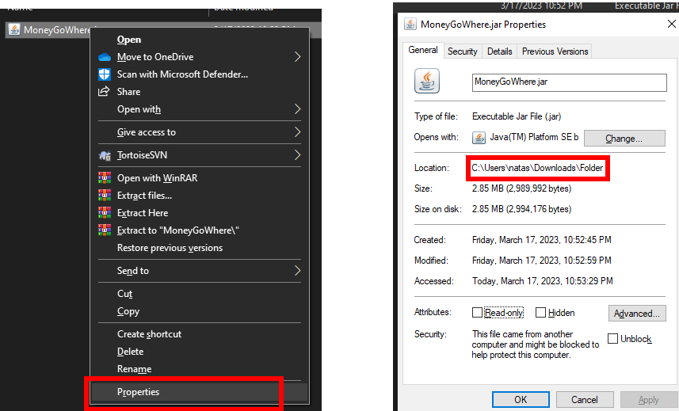

# User Guide

## General Table of Contents

* [Introduction](#introduction)
* [Advanced Guide](#advanced-guide)
* [Basic Guide](#basic-guide)
* [Discounts](#discounts)
* [Statistics](#statistics)
* [Save File](#save-file)
* [Glossary](#glossary)

## Introduction

Thank you for your interest in MoneyGoWhere! This user guide aims to show off the features of the application and how to
use it.

MoneyGoWhere is a point-of-sale, desktop app for tracking sales and inventory, optimised for use via a Command line
Interface (CLI). With the ability to type fast and with familiarity of the system, you will be able to quickly track
sales, check inventory and calculate change. This CLI application is comparable with GUI applications due to its
low-cost and adaptability.

This application is primarily tailored towards the hawker stall owners at The Deck in National University of Singapore.

<br>
<hr style="height:1px; border:none; width:60%; text-align:center; margin: 0 auto;">

## Advanced Guide

This version of our guide will bring you through how to use the features of MoneyGoWhere in a single command.

To see the beginner's version, [please click here](#basic-guide). Note that all functionality is the same, regardless of
the mode used.

### Table of Contents (Advanced)

1. [Quick Setup](#quick-setup)
2. [Features](#advanced-commands)
    1. [Help](#advanced-help)
    2. [Items](#advanced-mode-items)
        * [Add Items](#advanced-mode-add-an-item)
        * [Delete Items](#advanced-mode-delete-an-item)
        * [List Items](#advanced-mode-list-all-items)
        * [Find Items](#advanced-mode-find-an-item)
        * [Update Items](#advanced-mode-update-an-item)
    3. [Orders](#advanced-mode-orders)
        * [Add Order](#advanced-mode-add-an-order)
            * [Single Item](#advanced-mode-single-item)
            * [Multiple Items](#advanced-mode-multiple-items)
        * [List all Orders](#advanced-mode-list-all-orders)
        * [Refund an Order](#advanced-mode-refund-an-order)
3. [Save File](#save-file)
4. [Glossary](#glossary)

<hr style="height:1px; border:none; width:60%; text-align:center; margin: 0 auto;">

### Quick Setup

1. Ensure you have Java 11 installed,
   and [download the latest release of MoneyGoWhere](https://github.com/AY2223S2-CS2113T-T09-2/tp/releases) and place it
   in a folder.
2. Open the command terminal and navigate to the folder where the `.jar` file is, by doing `cd "<file path>"`.
3. Use the command `java -jar moneygowhere.jar` to launch our application. If correct, you should see the following on
   startup:
   **TODO: Insert Image**
4. When you are done using MoneyGoWhere, you can exit the application with the command `exit`.

Need more help? [Click here to see our detailed guide!](#setting-up-moneygowhere)

<hr style="height:1px; border:none; width:60%; text-align:center; margin: 0 auto;">

### Advanced Commands

* Note that all command options have multiple methods of input. For example, the option for name when adding an item can
  be signified by the flag `-n` or `--name`. More details are given in each command.
    * All of these command options are **case-sensitive**.
    * All examples will be given with the short-form flag, as it is the preferred method of input. However, the longer
      version will also be provided.
* All options are signified by `<example>`, which means you can change it according to what you need. Options wrapped
  in `{}` are optional, such as in [Multiple Items](#advanced-mode-multiple-items).
* In all the examples, the use of `>` signifies a user input. Normal text is _italicised_ to signify the options that
  will be used as the command.
* In advanced mode, all commands are prefixed with `/`, to distinguish them from the basic commands. Without the
  inclusion of this character, commands will be interpreted as a [basic command](#basic-commands).

<hr style="height:1px; border:none; width:60%; text-align:center; margin: 0 auto;">

#### Advanced Help

Entering this command will show you a list of all available commands.

Note that it is possible to use the given index as an command input, but doing so will execute commands as if you were
using the [basic mode](#basic-guide). To use these commands as in advanced mode, append a `/` at the beginning of the
command, along with the proper flags, as explained in the next few sections.

Format: `help`

The output of running the `help` command is as follows:

```text
Please enter a command: 
> help
There are 8 commands you can use in MoneyGoWhere. For more details, please refer to the user guide.
1. additem
2. deleteitem
3. listitem
4. updateitem
5. finditem
6. addorder
7. listorder
8. refundorder
```

#### Advanced Mode Items

There are five different commands you can run for items.

* [Add an Item](#advanced-mode-add-an-item)
* [Delete an Item](#advanced-mode-delete-an-item)
* [List all Items](#advanced-mode-list-all-items)
* [Find an Item](#advanced-mode-find-an-item)
* [Update an Item](#advanced-mode-update-an-item)

##### Advanced Mode Add an Item

This adds a new item to the menu. New items must have a name and price.

Format: `/additem -n "<name>" -p <price>` or `/additem --name "<name>" --price <price>`

* Name refers to the name of the item
    * It is case-sensitive
    * It has an upper limit of 25 characters
    * Names are unique, regardless of how the words are capitalized. `Chicken` and `chicken` will count as the same
      word.
* Price refers to the price of the item
    * It can have up to two decimal points (`2`, `2.1`, `2.22` are all valid inputs).

**Examples of Usage**

* You want to add a new item, _Chicken Rice_, which costs _$3.55_. To do so, use the
  command `/additem -n "Chicken Rice" -p 3.55`.

```text
Please enter a command: 
> /additem -n "Chicken Rice" -p 3.55
The command: /additem was successfully executed!
```

* You want to add a new item, _Egg_, which costs _$0.80_. To do so, use the command `/additem -n "Egg" -p 0.8`,
  or `/additem -n "Egg" -p 0.80`.

```text
Please enter a command: 
> /additem -n "Egg" -p 0.8
The command: /additem was successfully executed!
```

<br>

##### Advanced Mode Delete an Item

This removes an item from the menu, identified by its index when [listing all items](#advanced-mode-list-all-items).

Format: `/deleteitem -i <index>` or `/deleteitem --index <index>`

* The index must be a whole number, and a valid integer.

**Example of Usage**

* You change your mind and no longer want to sell _Chicken Rice_. [Looking at the menu](#advanced-mode-list-all-items),
  you find that the index of _Chicken Rice_ is _0_. To delete Chicken Rice, use the command `/deleteitem -i 0`.

```text
Please enter a command: 
> /deleteitem -i 0
The command: /deleteitem was successfully executed!
```

<br>

##### Advanced Mode List all Items

This lists all items currently in the menu. Do note that the index is important as it is the reference
for [adding Orders](#advanced-mode-add-an-order).

As much as possible, it is recommended to avoid changing the index of all items as it may cause confusion for you and
your staff.

Format: `/listitem`

* This command accepts no additional parameters. Even if additional parameters are listed, they will be ignored.

**Examples of Usage**

* List all items currently in menu, using the command `/listitem`

```text
Please enter a command: 
> /listitem
| Index | Name                      | Price |
| ----- | ------------------------- | ----- |
| 0     | Chicken Rice              | 3.55  |
| 1     | Egg                       | 0.80  |
The command: listitem was successfully executed!
```

<br>

##### Advanced Mode Find an Item

This command is used to find any and all items that match your input. It will give you the item's index, full name, and
price.

Format: `/finditem <partial name>`

* The partial name is case-insensitive.

**Example of Usage**

```text
Please enter a command: 
> /listitem
| Index | Name                      | Price |
| ----- | ------------------------- | ----- |
| 0     | Chicken Rice              | 3.55  |
| 1     | Egg                       | 0.80  |
| 2     | Whole Roast Chicken       | 16.00 |
| 3     | Laksa                     | 3.55  |
| 4     | Fried Rice                | 5.00  |
| 5     | Mee Goreng                | 4.50  |
| 6     | Whole White Chicken       | 16.00 |
The command: listitem was successfully executed!
Please enter a command: 
> /finditem Chicken
| Index | Name                      | Price |
| ----- | ------------------------- | ----- |
| 0     | Chicken Rice              | 3.55  |
| 2     | Whole Roast Chicken       | 16.00 |
| 6     | Whole White Chicken       | 16.00 |
The command: /finditem was successfully executed!
```

<br>

##### Advanced Mode Update an Item

If you make a mistake when entering details for one of your items, you can update it with this command. The index of the
item will not change.

Format `/updateitem -i <index> {-n "<name>"} {-p <price>}`

* The index refers to corresponding index when you use the command `/listitem`.
* The name refers to the new name of the item
* The price refers to the new name of the price
* For each execution of `/updateitem`, you can update the name and/or price of the item. You must update at least one
  detail for the command to work.

**Example of Usage**

Assume your menu currently looks like this:

```text
| Index | Name                      | Price |
| ----- | ------------------------- | ----- |
| 0     | Egg                       | 0.08  |
| 1     | Laksa                     | 3.55  |
| 2     | Fried Ric                 | 2.00  |
| 3     | Mee Goreng                | 4.50  |
| 4     | Wantom Mee                | 4.00  |
```

You realize three things:

1. The price of _Egg_ should be _$0.80_.
2. _Wantom Mee_ should be spelt _Wanton Mee_.
3. _Fried Ric_ should be formatted properly as _Fried Rice_, and its price should be _$4_.

Assuming the following examples are sequential. So, example 2 is completed after example 1, and example 3 is completed
after example 1 and 2.

**Example 1 - Updating the Price**

To fix the first issue, use the command `/updateitem -i 0 -p 0.80`.

After this command, the menu will be updated to:

```text
Please enter a command: 
> /updateitem -i 0 -p 0.80
The command: /updateitem was successfully executed!
Please enter a command: 
> /listitem
| Index | Name                      | Price |
| ----- | ------------------------- | ----- |
| 0     | Egg                       | 0.80  |
| 1     | Laksa                     | 3.55  |
| 2     | Fried Ric                 | 2.00  |
| 3     | Mee Goreng                | 4.50  |
| 4     | Wanton M                  | 4.00  |
The command: listitem was successfully executed!
```

**Example 2 - Updating the Name**

To fix the second issue, use the command `/updateitem -i 4 -n "Wanton Mee"`

After this command, the menu will be updated to:

```text
Please enter a command: 
/updateitem -i 4 -n "Wanton Mee"
The command: /updateitem was successfully executed!
Please enter a command: 
/listitem
| Index | Name                      | Price |
| ----- | ------------------------- | ----- |
| 0     | Egg                       | 0.80  |
| 1     | Laksa                     | 3.55  |
| 2     | Fried Ric                 | 2.00  |
| 3     | Mee Goreng                | 4.50  |
| 4     | Wanton Mee                | 4.00  |
The command: listitem was successfully executed!
```

**Example 3 - Updating the Name and Price**

To fix the third issue, use the command `/updateitem -i 2 -n "Fried Rice" -p 4`

After this command, the menu will be updated to:

```text
Please enter a command: 
> /updateitem -i 2 -n "Fried Rice" -p 4
The command: /updateitem was successfully executed!
Please enter a command: 
> /listitem
| Index | Name                      | Price |
| ----- | ------------------------- | ----- |
| 0     | Egg                       | 0.80  |
| 1     | Laksa                     | 3.55  |
| 2     | Fried Rice                | 4.00  |
| 3     | Mee Goreng                | 4.50  |
| 4     | Wanton Mee                | 4.00  |
The command: listitem was successfully executed!
```

<hr style="height:1px; border:none; width:60%; text-align:center; margin: 0 auto;">

#### Advanced Mode Orders

There are three different commands you can run for orders. It is highly recommended that you read the
entire [Add an Order](#advanced-mode-add-an-order) section as they are all related.

* [Add an Order](#advanced-mode-add-an-order)
    * [Add a Single Item to an Order](#advanced-mode-single-item)
    * [Add Multiple Items to an Order](#advanced-mode-multiple-items)
    * [Searching by Name](#advanced-mode-search-by-name)
* [List all Orders](#advanced-mode-list-all-orders)

##### Advanced Mode Add an Order

When you add an order, the total price will be given. Afterwards, you have to add the amount paid, as well as the method
of payment.

After adding the order, you will be prompted to add the payment, which can be done with `/pay -a <amount> -t <type>`
or `/pay --amount <amount> --type <type>`

* `Amount` refers to the amount paid, with up to 2 decimal points. (`2`, `2.1`, and `2.22` are all valid inputs).
* `Type` must use one of the following three modes: `Card`, `Cash` or `Others`.
    * It is case-insensitive

<br>

###### Advanced Mode Single Item

This mode of input allows you to add an order with a single item with ease.

**It is highly recommended to read the entire [`Add an Order` section](#advanced-mode-add-an-order), as details for
the `/pay` command is not addressed here, and all different modes of payment will be covered across both sections of
adding orders.**

Format: `/addorder -i <index> -q <quantity>` or `/addorder --index <index> --quantity <quantity>`

* The `index` refers to the index obtained when printing [all items](#advanced-mode-list-all-items).
* The quantity must be a positive whole number.
* Repeated sets of index and quantity must be separated by a comma.

**Example of Usage**
**Example 1 - Cash Payment**
Assume your menu is as follows:

```text
| Index | Name                      | Price |
| ----- | ------------------------- | ----- |
| 0     | Egg                       | 0.80  |
| 1     | Laksa                     | 3.55  |
| 2     | Fried Rice                | 4.00  |
| 3     | Mee Goreng                | 4.50  |
| 4     | Wanton Mee                | 4.00  |
```

* You have a customer, who wants to order _2_ plates of _Fried Rice_. To add their order, use the
  command `/addorder -i 3 -q 2`

```text
Please enter a command: 
> /addorder -i 3 -q 2
Order has been added successfully. Total amount: $9.00.
Please use /pay command to add payment for the order.
```

You tell them the total amount is _$9.00_, and they give you _$10_ in _cash_. So, you input `/pay -a 10 -t cash`, and
obtain the following result:

```text
Please use /pay command to add payment for the order.
> /pay -a 10 -t cash
The calculated change is $1.00.
The command: /pay was successfully executed!
```

**Example 2 - Card Payment**

* The next customer orders _3_ bowls of _Laksa_. This time, they want to pay with their card (the amount paid is exact).
  So you input `/addorder -i 1 -q 3`.

```text
Please enter a command: 
> /addorder -i 1 -q 3
Order has been added successfully. Total amount: $10.65.
Please use /pay command to add payment for the order.
```

Next, you use the command `/pay -a 10.65 -t card` and obtain the following result:

```text
Please use /pay command to add payment for the order.
> /pay -a 10.65 -t card
The calculated change is $0.0.
The command: /pay was successfully executed!
```

<br>

###### Advanced Mode Multiple Items

This command allows you to add multiple items to a single order.

Format: `/addorder -I [<index>:<quantity>{,<index>:<quantity>}`

* You need at least one set of `<index>:<quantity>`. Multiple sets need to be separated by commands, without spaces.
* The same item can be input multiple times.

**It is highly recommended to read the entire [`Add an Order` section](#advanced-mode-add-an-order), as details for
the `/pay` command is not addressed here, and all different modes of payment will be covered across both sections of
adding orders.**

**Example of Usage:**

Assume your menu is as follows:

```text
| Index | Name                      | Price |
| ----- | ------------------------- | ----- |
| 0     | Egg                       | 0.80  |
| 1     | Laksa                     | 3.55  |
| 2     | Fried Rice                | 4.00  |
| 3     | Mee Goreng                | 4.50  |
| 4     | Wanton Mee                | 4.00  |
```

A large group comes to your store and orders _2_ bowls of _Laksa_, _3_ plates of _Fried Rice_, and _2_ plates of Wanton
Mee. At the last moment, your customer adds another _2_ bowls of _Laksa_. This customer uses a voucher to pay (an "
_others_" mode of payment). To add this lengthy order, you can use the command `/addorder -I [1:2,2:3,2:4,1:2] `.

```text
Please enter a command: 
> /addorder -I [1:2,2:3,4:2,1:2]
Order has been added successfully. Total amount: $42.2.
Please use /pay command to add payment for the order.
> /pay -a 42.2 -t others
The calculated change is $0.0.
The command: /pay was successfully executed!
```

<br>

###### Advanced Mode Search by Name

Forgot the index of an item? Fret not! You can also add an item to an order by searching its name.

* For single items, use the command `/addorder -i "<name>" -q <quantity>`
* For multiple items, use the command `/addorder -I ["<name>":q{,"<name>":q}]`
    * As usual, it requires a minimum of one item, and different items are split by a comma.

**Example of Usage**

**Single Item Order**

```text
Please enter a command: 
/addorder -i "laksa" -q 2
Order has been added successfully. Total amount: $7.1.
Please use /pay command to add payment for the order.
/pay -a 7.1 -t card
The calculated change is $0.0.
The command: /pay was successfully executed!
```

**Multiple Items Order**

```text
Please enter a command: 
/addorder -I ["laksa":2,"mee goreng":4]
Order has been added successfully. Total amount: $25.1.
Please use /pay command to add payment for the order.
/pay -a 25.1 -t cash
The calculated change is $0.0.
The command: /pay was successfully executed!
```

<hr style="height:1px; border:none; width:60%; text-align:center; margin: 0 auto;">

##### Advanced Mode List all Orders

After adding many orders, you may wish to view a list of all transactions.

Format: `/listorder`

**Example of Usage**

```text
> /listorder
================================================
Order 1
Order ID: f5fda17b-a520-4ea0-a42a-cefa6c9315d7
Order status: COMPLETED
Order time: 2023-03-20 16:01:40
1. Laksa x2
2. Fried Rice x3
3. Wanton Mee x2
4. Laksa x2

Subtotal: $34.20
================================================
Order 2
Order ID: ffc76ebe-09b1-48d2-9378-af49c234f399
Order status: COMPLETED
Order time: 2023-03-20 15:16:52
1. Mee Goreng x2

Subtotal: $9.00
================================================
```

The above example is just a small extract from a long list of transactions and is non-exhaustive.

The Order ID is important as it is used for [refunding orders](#advanced-mode-refund-an-order).

<hr style="height:1px; border:none; width:60%; text-align:center; margin: 0 auto;">

##### Advanced Mode Refund An Order

If you made a mistake in an order, or wish to refund a customer's order, you may do so with this feature.

Format: `/refundorder <order ID>`.

* The order ID refers to the order ID given from [printing the list of orders](#advanced-mode-list-all-orders).
    * You cannot refund an order that has already been refunded.

**Example of Usage**
Assume you want to refund the following order.

```text
================================================
Order 2
Order ID: ffc76ebe-09b1-48d2-9378-af49c234f399
Order status: COMPLETED
Order time: 2023-03-20 15:16:52
1. Mee Goreng x2

Subtotal: $9.00
================================================
```

To refund it, you use the command `/refundorder ffc76ebe-09b1-48d2-9378-af49c234f399`.

```text
Please enter a command: 
> /refundorder ffc76ebe-09b1-48d2-9378-af49c234f399
The command: /refundorder was successfully executed!
```

This changes the status of the order to _REFUNDED_.

```text
================================================
Order 2
Order ID: ffc76ebe-09b1-48d2-9378-af49c234f399
Order status: REFUNDED
Order time: 2023-03-20 15:16:52
1. Mee Goreng x2

Subtotal: $9.00
================================================
```

<br>

### Advanced Mode Command Summary

Note that the long version of the commands, for example `--name` instead of `-name` will be omitted as it is not the
preferred mode of input.

| Command             | General Format                                           | Example                                                                                                    |
|---------------------|----------------------------------------------------------|------------------------------------------------------------------------------------------------------------|
| help                | `help`                                                   | `help`                                                                                                     |
| additem             | `/additem -n "<name>" -p <price>`                        | `/additem -n "Chicken Rice" -p 3.5`                                                                        |
| deleteitem          | `/deleteitem -i <index>`                                 | `/deleteitem -i 0`                                                                                         |
| listitem            | `/listitem`                                              | `/listitem`                                                                                                |
| finditem            | `/finditem <description>`                                | `/finditem "Chicken R"`                                                                                    |
| updateitem          | `/updateitem -i <index> {-n "<name>"} {-p <price>}`      | `/updateitem -i 2 -n "Laksa"` <br> `/updateitem -i 3 -p 3.55` <br> `/updateitem -i 1 -n "Fried Rice" -p 5` |
| addorder (single)   | `/addorder -i {index} -q {quantity}`                     | `/addorder -i 10 -q 5` <br> `/addorder -i "Chicken Ri" -q 5`                                               |
| addorder (multiple) | `/addorder -I [<index>:<quantity>{,<index>:<quantity>}]` | `/addorder -I [1:3,"Chicken Ri":5,6:2]`                                                                    |
| listorder           | `/listorder`                                             | `/listorder`                                                                                               | 
| refundorder         | `/refundorder <ID>`                                      | `/refundorder ffc76ebe-09b1-48d2-9378-af49c234f399`                                                        |

<br>
<hr>
<br>

## Basic Guide

This version of our guide will bring you through how to use the many features of MoneyGoWhere, in basic mode. In this
mode, you will be prompted step-by-step to the various features
To see the advanced version, [please click here](#advanced-guide). Note that all functionality is the same, regardless
of the mode used.

### Table of Contents (Basic)

1. [Setting up MoneyGoWhere](#setting-up-moneygowhere)
2. [Basic Mode Style Guide](#basic-mode-style-guide)
3. [Basic Commands](#basic-commands)
    1. [Items](#basic-mode-items)
        * [Add Items](#basic-mode-add-an-item)
        * [Delete Items](#basic-mode-delete-an-item)
        * [List all Items](#basic-mode-list-all-items)
        * [Find an Item](#basic-mode-find-an-item)
        * [Update an Item](#basic-mode-update-an-item)
    2. [Orders](#basic-mode-orders)
        * [Add an Order](#basic-mode-add-an-order)
        * [List all Orders](#basic-mode-list-all-orders)
4. [Save File](#save-file)
5. [Glossary](#glossary)

### Setting up MoneyGoWhere

1. Before installing and using MoneyGoWhere, do note that Java 11 is required. If you do not already have it installed,
   you can do so [here](https://www.oracle.com/sg/java/technologies/downloads/#java11).
2. After installing Java 11, please download the `.jar`
   file [here](https://github.com/AY2223S2-CS2113T-T09-2/tp/releases) and place it in a folder. Doing so ensures that
   the save-file will not be lost, allowing you to use data that you have previously entered. Click
   on `MoneyGoWhere.jar` to automatically download the file. Ensure that it is the latest version.
   **#TODO: Add image**
3. Move the jar file into a folder. This will allow you to view all data related to MoneyGoWhere easily, as all data
   files will be stored here.
4. Open the command terminal and navigate to the folder where the `.jar` file is. If you are unsure of how to do so,
   follow steps 5 to 7.
5. Right-click the file and select the "Properties" option. Then, copy the text under "Location".
   
6. Open a command terminal by entering `cmd` in your start menu.
7. In the terminal, navigate to the location of the folder by doing `cd "<file path>"`.
    - This step is important as it ensures that the saved tasks file will be saved in the same directory. Otherwise, the
      file will be stored in the current working directory.
8. Use the command `java -jar MoneyGoWhere.jar` to launch MoneyGoWhere. If done correctly, you will see something like
   this on your first start up:
   **#TODO: Add image**
9. When you are done using the app, enter `exit` to shut the application down. This ensures that Duke will save your
   data, as saving data is only done during the shut-down process.

### Basic Mode Style Guide

### Basic Commands

#### Basic Mode Items

##### Basic Mode Add an Item

##### Basic Mode Delete an Item

##### Basic Mode List all Items

##### Basic Mode Find an Item

##### Basic Mode Update an Item

#### Basic Mode Orders

##### Basic Mode Add an Order

##### Basic Mode List all Orders

<br>
<hr>

### Basic Mode Command Summary

## Statistics

## Save File

## Glossary

| Term | Explanation |
|------|-------------|
| Item | Explanation |
